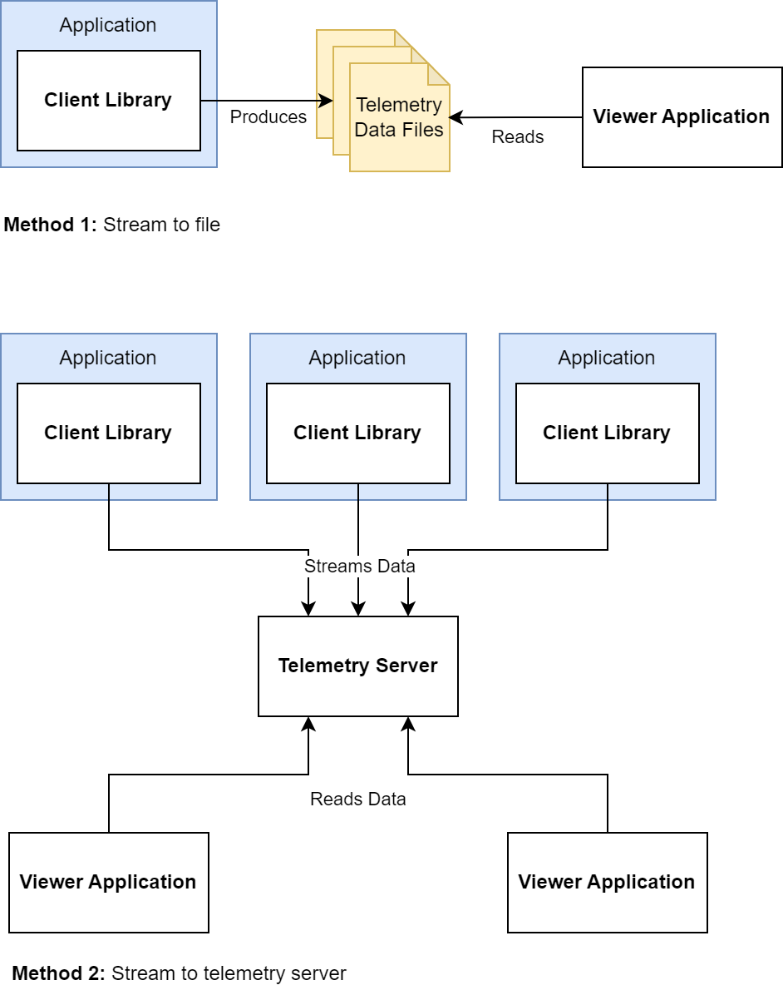
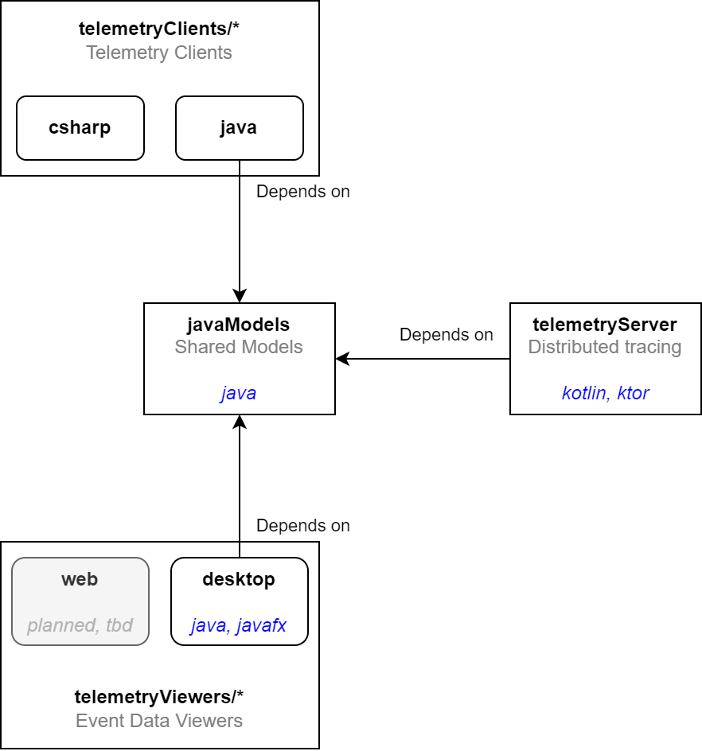

# Telegram

 

Telegram is a lightweight instrumentation toolkit for application observability. Unlike [OpenTelemetry](https://opentelemetry.io/),
this project only specializes in trace event data -- metrics and log data are not supported. Telegram comes with an end-to-end 
solution to produce, collect and visualize trace event data from one or more application sources. The data may be stored to local disk, 
or streamed to a telemetry server in real time. The data can be viewed from one the provided telemetry viewers.

This project places an emphasis on trace data visualization. Views can be tailored to the applications' domain, whether to track the 
journey of HTTP requests, or to reason about the internal timings of an application's concurrent processing logic.

Telegram serves as a software design and learning exercise for the author, as well as a bootstrapping solution for application observability, 
especially during early stage development. It is not intended to be a viable alternative to OpenTelemetry. 

**Precision Limitations:** <u>Event timestamps use microsecond precision, but no guarantees are made to ensure microsecond resolution.</u> 
Telegram aims to provide time measurements no worse than 100 millisecond granularity. The project should not be used to measure events that require
sub-millisecond accuracy.

**Supported Languages:** Telemetry Client libraries will be made available for Java (1.8 or above), and C# (planned)

## Data Flow

Telegram supports two data transfer modes:
1. **Stream telemetry data to file.** Suitable for deployed applications where connection to a telemetry server is not feasible. The client library 
can record trace data locally for retrieval later. 
2. **Stream data to a telemetry server.** The preferred method, especially if more than one application is to be instrumented. Event data is
collected and accessed in one place.

## Project Structure

 - **telemetryClients/*** contain client libraries used by application(s) to generate trace event data. The Java client library depends on **javaModels** 
for Telegram's data models. Client libraries for other languages define and maintain their own version of data models according to the specification.
 - **javaModels** is the project's data model implementation in Java. Most of the Telemetry subprojects are implemented in Java or Kotlin, 
this project is a key dependency for the other JVM projects.
 - **telemetryServer** contains the source code for the real-time data collection server for distributed event tracing.
 - **telemetryViewers/*** contains the source code for applications that can load and visualize the collected trace event data.

## Progress
### MVP
 - [ ] Data model specifications
 - [ ] Java data models
 - [ ] Java client library
 - [ ] Desktop viewer can load & display telemetry data

### Functional Local Data Viewer
 - [ ] Desktop data viewer design
 - [ ] Vertical & horizontal timeline scrolling
 - [ ] Timeline zoom
 - [ ] Group events by custom attribute value
 - [ ] View event details (attribute values) + visual aids
 - [ ] C# client library

### Fully-Featured Local Data Viewer
 - [ ] Nested event groups
 - [ ] View event data from different local data files on a unified timeline
 - [ ] Define & re-use view profiles
     - [ ] Grouping rules
     - [ ] Color-coding rules
     - [ ] Ability to export & import view profiles

### Distributed Event Tracing via Telemetry Server
 - [ ] Telemetry server design
 - [ ] Application to stream events to telemetry server
 - [ ] Desktop viewer to fetch events from telemetry server
 - [ ] Telemetry server controls & configuration (i.e. data purging rules)

## Documentation
For specifications and details, see the [Project Wiki](https://github.com/dark-comet/Telegram/wiki).